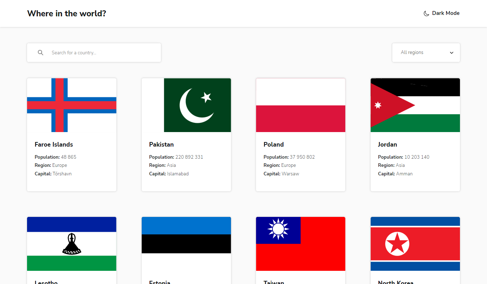
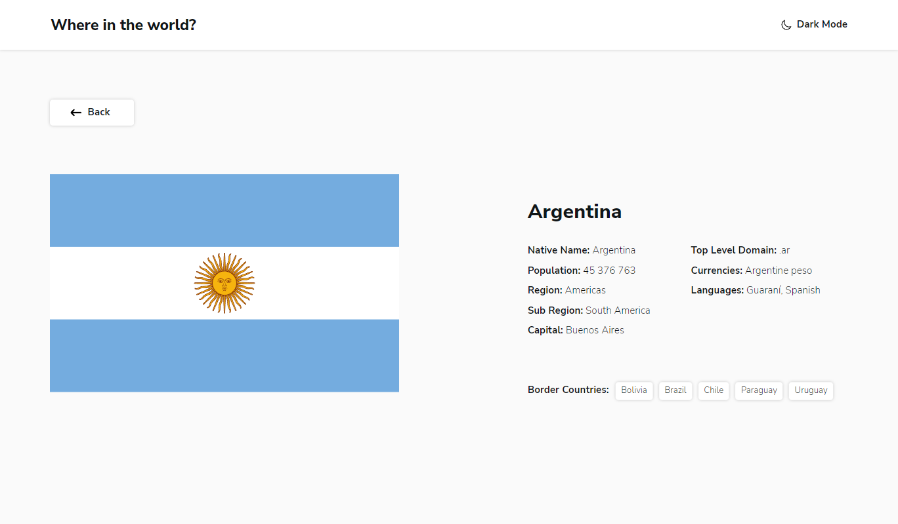

# Проект - Countries Info (with State Management)

[README in English](./README-en.md)

Проект представляет из себя SPA, предоставляющие информацию о странах. Выполнен в рамках задания с сайта [Frontend Mentor](https://www.frontendmentor.io). Информация о странах предоставляется [REST Countries API](https://restcountries.com).

## Оглавление

- [Обзор проекта](#обзор-проекта)
  - [Задачи проекта](#задачи-проекта)
  - [Функциональность проекта](#функциональность-проекта)
  - [Screenshot](#screenshot)
  - [Директории проекта](#директории-проекта)
  - [Запуск проекта](#запуск-проекта)
  - [Ветки проекта](#ветки-проекта)
  - [Ссылки](#ссылки)
- [Ход выполнения проекта](#ход-выполнения-проекта)
  - [Используемые технологии](#используемые-технологии)
  - [Чему я научился работая над проектом](#чему-я-научился-работая-над-проектом)
- [Автор](#автор)

## Обзор проекта

### Задачи проекта

Предоставить пользователям информацию о странах, их столицах, языках, валюте, населении, границах.

### Функциональность проекта

- Просмотр краткой информации о всех странах на главной странице
- Поиск страны по названию
- Фильтрация стран по региону
- Просмотр детальной информации о стране на отдельной странице
- Переход к приграничной стране через ссылки на странице детального просмотра
- Изменение цветовой схемы между светлой и тёмной темами

### Screenshot

### Директории проекта

- `src/assets` — директория со статичными файлами
- `src/components` — директория с компонентами
- `src/pages` — директория с компонентами страниц
- `src/store` — директория с файлами Redux
- `src/styles` — директория с глобальными стилями и темами
- `src/UI` — директория с компонентами UI
- `src/utils` — директория со вспомогательными утилитами

### Запуск проекта

- `npm start` - режим разработки с запуском локального сервера
- `npm run build` - режим сборки проекта в продакшн
- `npm run test` - запуск в режиме тестирования
- `npm run eject` - режим извлечения конфигов CRA
- `npm run lint` - запускает линтер
- `npm run lint:fix` - запускает линтер, в режиме устранения мелких замечаний
- `npm run format` - запуск форматера кода
- `npm run prepare` - подготавливает Husky к работе, запускается единожды при старте проекта
- `npm run commit` - запускает commitizen для коммита
- `npm run storybook` - запускает Storybook в режиме разработки
- `npm run build-storybook` - запускает Storybook в режиме продакшн

### Ветки проекта

- `master` - [главная ветка. Версия с использованием Redux Toolkit](https://github.com/Bjorn86/countries-info-sm/tree/main)
- `redux` - [версия с использованием Redux](https://github.com/Bjorn86/countries-info-sm/tree/redux)

### Ссылки

- [Ссылка на репозиторий проекта](https://github.com/Bjorn86/countries-info-sm)
- [Ссылка на демо-страницу проекта](https://bjorn86.github.io/countries-info-sm/)

## Ход выполнения проекта

### Используемые технологии

- HTML
- SCSS
- JS
- [React](https://react.dev/)
- [React Router](https://reactrouter.com/en/main)
- [Redux](https://redux.js.org/)
- [Redux Toolkit](https://redux-toolkit.js.org/)
- [Redux Persist](https://www.npmjs.com/package/redux-persist)
- [Styled components](https://styled-components.com/)
- [Axios](https://www.npmjs.com/package/axios)
- [react-helmet-async](https://www.npmjs.com/package/react-helmet-async)
- [Storybook](https://storybook.js.org/)
- Адаптивная вёрстка
- Семантическая вёрстка

### Чему я научился работая над проектом

- Работе с Redux Toolkit
- Работе с Styled components

## Автор

**Данила Легкобытов**

- e-mail: [legkobytov-danila@yandex.ru](mailto:legkobytov-danila@yandex.ru)
- LinkedIn: [in/danila-legkobytov](https://www.linkedin.com/in/danila-legkobytov/)
- Telegram: [@danila_legkobytov](https://t.me/danila_legkobytov)
- Frontend Mentor: [@danila_legkobytov](https://www.frontendmentor.io/profile/Bjorn86)
